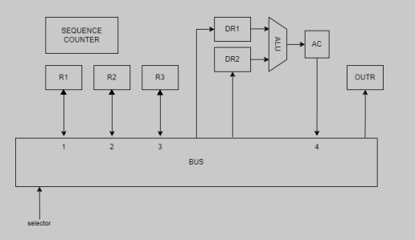
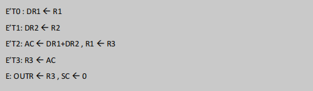

## Verilog code of a 4-bit cpu like circuit with testbench

Here is verilog code of a 4-bit cpu like circuit with testbench module like the picture below:  
 

that does these RTL commands in 4 clocks:
